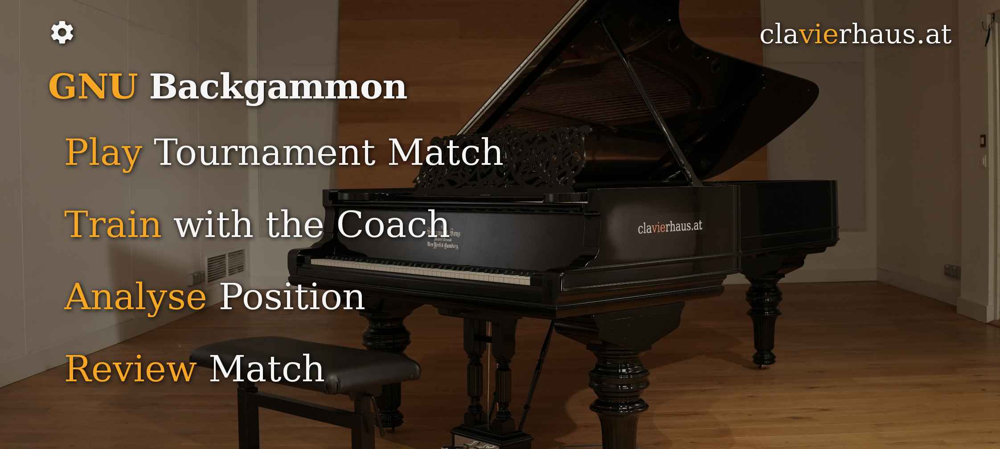
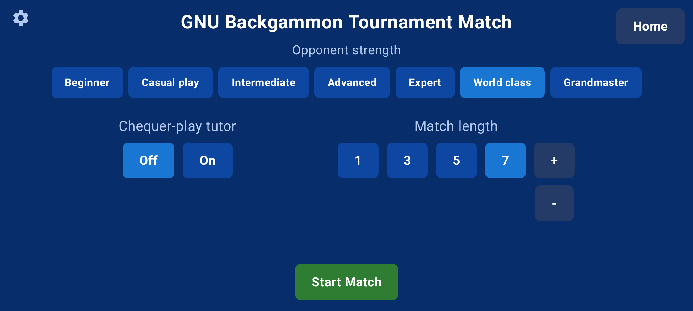
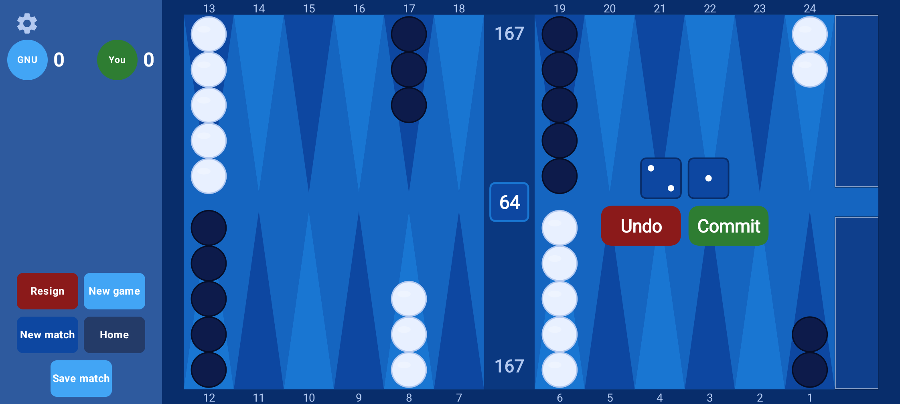
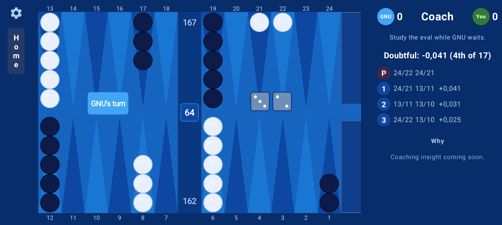
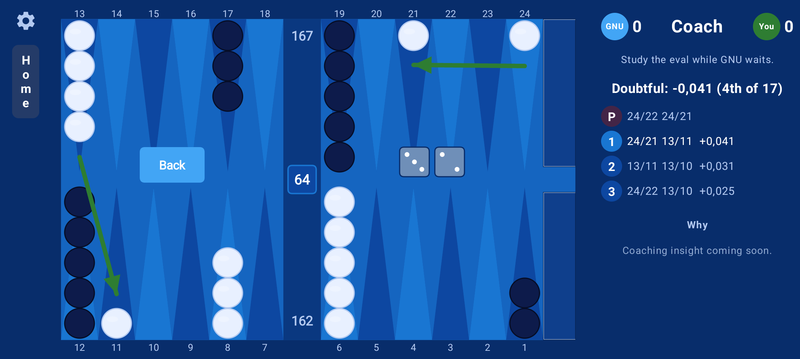
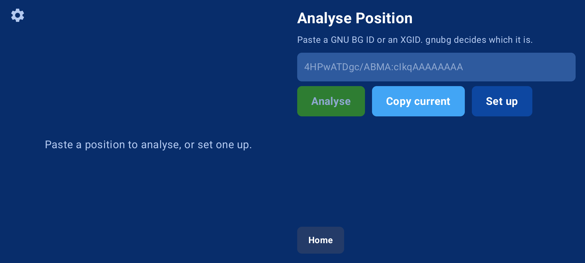

# GNU Backgammon for Android

A faithful Android port of [GNU Backgammon](https://www.gnu.org/software/gnubg/) — the free, world-class backgammon engine. Not a re-implementation and not a stripped-down evaluator: the real gnubg engine runs under a modern touch interface, so the strength you play, the cube decisions, and the analysis you learn from are gnubg's own — checkable against the upstream source in this repository. All offline, all free, all open source.

  

> **Status: 0.21.1.** Four modes — **Play, Train, Analyse, Review** — are built and working, and the core is stable. The active frontier is deeper analysis reporting and online play. See the [Roadmap](#roadmap) and [`CHANGELOG.md`](CHANGELOG.md).

## What it does

**Play** — Full matches against the gnubg engine, at any match length, across seven strength levels from Beginner up to Grandmaster (3-ply). Every move, cube decision, and resignation is gnubg's own; there are no app-side heuristics. The full doubling cube (offer, take, drop, redouble, resign), tournament rules (Crawford, Jacoby, automatic doubles, beavers, cube on/off), and a choice of match equity table — Kazaross-XG2, Woolsey, Jacobs & Trice, Snowie, and the other canonical gnubg tables. A live tutor shows gnubg's own equity as you play. (At 3-ply a move takes a few seconds: the honest cost of a strong pruned, NEON-vectorised search — see [`docs/THREADING.md`](docs/THREADING.md).)

**Train with the Coach** — Play gnubg with the engine judging each move. Every move gets one of three honest verdicts — best, fine-but-not-best (with what beat it), or flagged (with gnubg's severity and the equity it cost) — and a two-tap before/after explorer steps you through your move and gnubg's better ones on the board. In matches longer than a point the cube comes into play, and the Coach judges the doubles you offer, take, and drop. Every value on screen is gnubg's own; the app only renders it.

**Analyse a position** — Build any position on the board (tap points and the bar to place checkers, tap the tray to clear) or paste a GNU BG ID or XGID from a forum, book, or another app. With dice set, gnubg ranks the chequer plays; with **no dice**, gnubg gives the cube decision — double / take / drop and the equities behind it, exactly as its desktop edit mode does. The GNU BG ID is shown and can be copied out. This is the feature most people open XG Mobile for — here it is free and runs on current Android.

**Review a match** — Save a whole match to standard `.sgf` at any point through the Android file picker, then step through it game by game and move by move on gnubg's own board. At every move: what was played, what gnubg preferred, the equity cost, and gnubg's verdict (doubtful / bad / very bad). Navigation is gnubg's own game-record walk, not a re-derivation. Saved files open in desktop gnubg and Backgammon Studio.

### One board, every device

The board is drawn from a single geometry computed once from the screen size, so a tap lands exactly where the eye says it will — verified from tablet (16:10) to tall phone (20:9), which sit on opposite sides of the point where the scaling flips sign. Nothing scrolls; what does not fit is made to fit. Three hand-tuned themes (Ocean, Classic, Forest) plus a System option that follows Material You, and the whole interface themes together. Settings persist across restarts. Built for Android 12+ (minSdk 31), landscape, tap or drag to move.

## Screenshots

  
  

  
  

  

## Design principle: gnubg is the authority

**GNU Backgammon is the sole authority for all game logic and analysis.** The Android layer draws the board, turns taps into gnubg commands, and presents gnubg's output — it does not invent, re-rank, or second-guess a single decision. A position built in the editor is encoded by gnubg's own encoders and installed through the same validated path a pasted ID takes; a cube verdict is gnubg's own `GetCubeRecommendation`, not a Kotlin mapping of it. Every divergence the mobile context forces is recorded in [`PROVENANCE.md`](PROVENANCE.md). This is what makes the app trustworthy: the strength you face and the analysis you learn from are gnubg's, checkable against the upstream source shipped here.

## Building

Requirements:

- Android SDK with NDK `27.0.11718014`
- JDK 21
- CMake, Meson and Ninja
- curl, patch and standard Unix build tools
- Android 12 or newer on an ARM64 device

Build the pinned GLib dependency and GNU Backgammon engine first, then build
the Android application:

    ./build_native_android.sh
    cd gnubg-app
    ./gradlew assembleDebug

For an unsigned distributor release:

    ./build_native_android.sh
    cd gnubg-app
    ./gradlew assembleRelease

`build_native_android.sh` downloads the official GLib 2.88.1 source archive,
verifies its SHA-256 checksum, cross-compiles it with the Android NDK, builds
`engine-core/` and `jni-bridge/`, and places the resulting ARM64 shared
libraries in the Android `jniLibs` directory.

No compiled engine or GLib binaries are stored in Git. A clean clone can
rebuild every native component from the tracked source and the pinned,
checksum-verified GLib source archive.

## Repository layout

- `gnubg-app/` — the Android app (Kotlin, Jetpack Compose)
- `jni-bridge/` — the JNI/native bridge: a small facade over the engine plus the JNI bindings
- `engine-core/` — the GNU Backgammon engine core, compiled for Android
- `upstream-source/` — reference upstream GNU Backgammon source
- `docs/` — project documentation

## Documentation

Start with [`docs/STATUS.md`](docs/STATUS.md), the authoritative current-state document. To contribute, [`docs/ARCHITECTURE_FOR_CONTRIBUTORS.md`](docs/ARCHITECTURE_FOR_CONTRIBUTORS.md) traces exactly how a tap becomes a gnubg command and back. [`CHANGELOG.md`](CHANGELOG.md) records each release and [`docs/ROADMAP.md`](docs/ROADMAP.md) the forward plan; deeper references — architecture, threading, the traps this port hit, and the coach design — live under [`docs/`](docs/).

## Roadmap

The four modes are built and the core is solid. The frontier now:

- **Analysis reporting** — the per-move verdict inside review is done; still to come are a jump-to-blunder move list and a whole-match performance rating. See [`docs/ROADMAP_ANALYSIS_PARITY.md`](docs/ROADMAP_ANALYSIS_PARITY.md).
- **Review while playing** — stepping back through the live game record in place, not only from a saved file.
- **Online play** — a modern client for [FIBS](http://www.fibs.com/), the long-running free backgammon server, with local gnubg analysis alongside.
- **Multi-core evaluation** for faster analysis and rollouts.

## Comparison

Two apps cover this ground for most players today. This port is free, open, offline, and does position setup, match save, and reviewed playback together, on gnubg's own engine:

- **XG Mobile** has the position editor it is chiefly used for, but that editor is widely described as fiddly and the app has grown hard to install on current Android. This port's editor starts from an empty board — place what you have, the gnubg way — is free, and targets Android 12+.
- **Backgammon NJ** shows a position's GNU BG ID, top moves, and cube decision during play, and its paid package steps through matches — but it has no position editor. This port both sets up positions *and* reads pasted GNU BG IDs, so a BGNJ user's IDs drop straight in.

Neither is a criticism of strong apps; the point is that this one is free, open, offline, and covers setup, save, and review together on gnubg's own engine.

## Contributing

Contributions are welcome. The best starting point is [`docs/ARCHITECTURE_FOR_CONTRIBUTORS.md`](docs/ARCHITECTURE_FOR_CONTRIBUTORS.md). Please keep the guiding rule in mind: game and analysis logic belongs in gnubg, not the app layer. If a piece of Kotlin computes, ranks, or classifies a backgammon decision, it is in the wrong place.

## License

This program is a modified derivative of **GNU Backgammon**, licensed under the **GNU General Public License, version 3 or (at your option) any later version (GPL-3.0-or-later)**.

- Full license text: [`COPYING`](COPYING)
- Attribution, copyright holders, and modification notice: [`NOTICE`](NOTICE)
- Record of every divergence from upstream: [`PROVENANCE.md`](PROVENANCE.md)

GNU Backgammon is Copyright © the Free Software Foundation, Inc. and the GNU Backgammon AUTHORS; the per-file copyright notices in `engine-core/` retain the authoritative attribution. The Android front end, JNI bridge, and port integration are Copyright © 2025–2026 clavierhaus <gnubg@clavierhaus.at>. This program comes with ABSOLUTELY NO WARRANTY; it is free software, redistributable under the conditions of the GPL, and you have the right to the complete corresponding source code.
