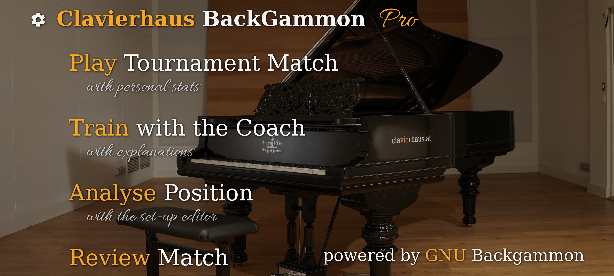
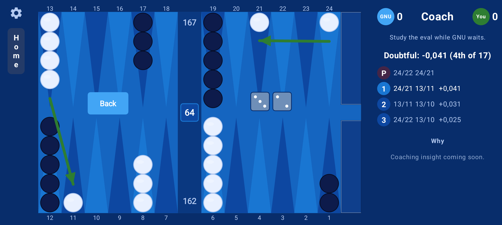

# CBG Pro — Clavierhaus Backgammon

*powered by GNU Backgammon*

**CBG Pro 1.0.0 is a milestone for backgammon on Android: the complete
GNU Backgammon engine — the same code, the same neural nets, the same
numbers as the desktop reference — under a modern touch interface, with
an analysis, training, and record-keeping suite that has no counterpart
on the platform.** Entirely offline: no server, no account, no ads, no
telemetry — the app does not request the network permission at all.
Free software, GPL-3.0, source in front of you.

We do not ask to be believed. Every claim in this README is checkable
against this repository — the vendored engine source, the verification
harnesses, the reproducible-build tooling — and the strongest claims
ship with the tools to check them.

  

## Why there is nothing similar

- **The engine is not "based on" GNU Backgammon — it *is* GNU
  Backgammon.** Version 1.08.003, vendored verbatim, with the neural-net
  weights byte-identical to the upstream release. Every move, cube
  decision, equity, and verdict on screen is the engine's own; the app
  renders and never re-derives. There are no app-side backgammon
  heuristics anywhere.
- **Regulation rollouts on a phone.** 1296-trial, cubeful,
  variance-reduced, quasi-random rollouts — the same discipline desktop
  analysts use — seed-reproducible, with per-game logging in gnubg's own
  format. The comparison harness that verifies our rollout core against
  desktop GNU Backgammon, trial by trial and dice roll by dice roll,
  ships in this repository (`tools/rollout_harness/`).
- **A Coach that is correct or silent.** Every explanation is licensed
  by the engine's numbers; when the numbers don't justify a sentence,
  the Coach says less rather than inventing a reason. Tap any better
  alternative and watch it play out on the board against your own move.
- **Your career, signed.** Finished matches enter a tamper-evident,
  cryptographically chained record — your results, provable, in plain
  files you own. The verification code is right here, open, like
  everything else.
- **Your Personal Stats.** Match statistics computed by gnubg's own
  analysis — error rates, luck, cube handling — with every number
  labeled by what it is and where it came from. No invented metrics.
- **A tournament match clock**, written as a clean C module against
  tournament regulation (delay clock), and offered upstream to the GNU
  Backgammon project itself (`docs/upstream/`).
- **Reproducible builds.** Two independent builds of a release commit
  produce byte-identical APKs, and `tools/verify_reproducible.sh` proves
  it on demand (see [`docs/REPRODUCIBLE_BUILD.md`](docs/REPRODUCIBLE_BUILD.md)).

## What it does

**Play** — Full matches against the engine at any match length, across
seven strength levels from Beginner to Grandmaster (3-ply). The full
doubling cube (offer, take, drop, redouble, resign), tournament rules
(Crawford, Jacoby, automatic doubles, beavers), and the canonical match
equity tables — Kazaross-XG2, Woolsey, Jacobs & Trice, Snowie, and the
rest of gnubg's set. A live tutor can show the engine's own equity as
you play, and the match clock brings tournament time pressure when you
want it.

**Train with the Coach** — Play with the engine judging every move.
Each move gets one of three honest verdicts — best, fine-but-not-best
(with what beat it), or flagged (with gnubg's severity and the equity it
cost) — and a two-tap before/after explorer steps you through your move
and the engine's better ones, arrow by arrow, on the board. In matches
past one point the Coach judges your cube actions too. Undo is a
teaching tool: take the move back, try the better idea, feel the
difference.

  

**Analyse** — Paste a GNU BG ID, Match ID, or XGID from a forum, a
book, or another app — or build any position by hand on the set-up
editor board. With dice, the engine ranks the chequer plays; without
dice, it gives the cube decision — double / take / drop and the
equities behind it, exactly as desktop gnubg's edit mode does. And when
ranking isn't enough, roll the position out: regulation rollouts,
right on the device.

**Review** — Save whole matches to standard `.sgf` at any point, then
step through game by game and move by move on the engine's own game
record: what was played, what gnubg preferred, the equity cost, the
verdict. Saved files open unchanged in desktop GNU Backgammon and
Backgammon Studio.

## Honesty by construction

One principle underlies the whole app: **GNU Backgammon is the sole
authority**, and the interface never substitutes its own judgement.
Every number on screen is the engine's, every explanation is bounded by
what the engine's numbers actually support, and where the engine is
silent the app is silent too. The worst thing an analysis tool can do
is sound confident about something it doesn't know; this one is built
so it can't.

## Your data is yours

Matches, careers, and settings live in a folder **you** choose through
Android's file picker — plain `.sgf` and plain files, readable by
desktop gnubg today and by anything else in twenty years. Move the
folder, back it up, point a new phone at it: the same folder works
across installs. Nothing is locked in, because nothing is ever sent
anywhere — there is no "anywhere" in this app.

## One board, every device

The board is drawn from a single geometry computed once from the screen
size, so a tap lands exactly where the eye says it will — verified from
tablet (16:10) to tall phone (20:9). Nothing scrolls; what does not fit
is made to fit. Three hand-tuned themes (Ocean, Classic, Forest) plus a
System option that follows Material You. Built for Android 12+
(minSdk 31), landscape, tap or drag to move.

## Built to be checked

- The engine source is vendored in `engine-core/` — diff it against
  upstream GNU Backgammon 1.08.003 yourself.
- `tools/rollout_harness/` builds the port's exact engine subset on a
  desktop and verifies rollouts against desktop gnubg — same seed, same
  dice, same games, logged in gnubg's own format by gnubg's own code.
- `tools/verify_reproducible.sh` builds any commit twice, independently,
  and compares the APKs byte for byte.
- The build recipes are in the tree; F-Droid builds from them and
  verifies the published APK against them.

## Building

    ./build_native_android.sh     # NDK build of the engine (glib included)
    cd gnubg-app && ./gradlew assembleDebug

Full requirements and the deterministic-build details:
[`docs/REPRODUCIBLE_BUILD.md`](docs/REPRODUCIBLE_BUILD.md).

## License and lineage

GPL-3.0-or-later, like the GNU Backgammon it carries. CBG Pro exists
because gnubg's authors built something extraordinary and licensed it
freely; this project's additions — the interface, the Coach, the career
record, the clock, the harnesses — are offered back under the same
terms. The match-clock module has been submitted upstream.

*CBG Pro. The whole game, in your pocket, owing nothing to anyone.*
